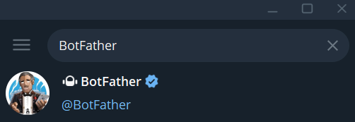
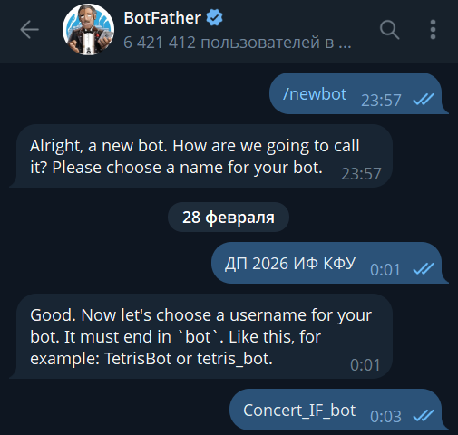
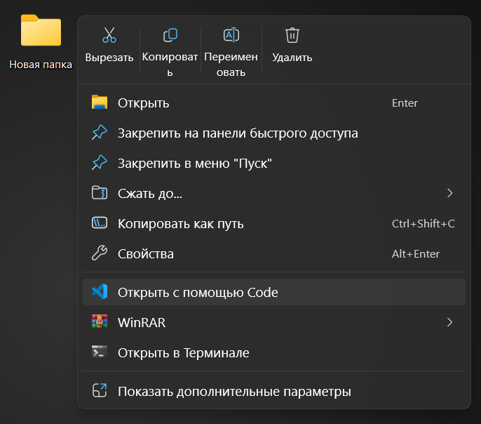
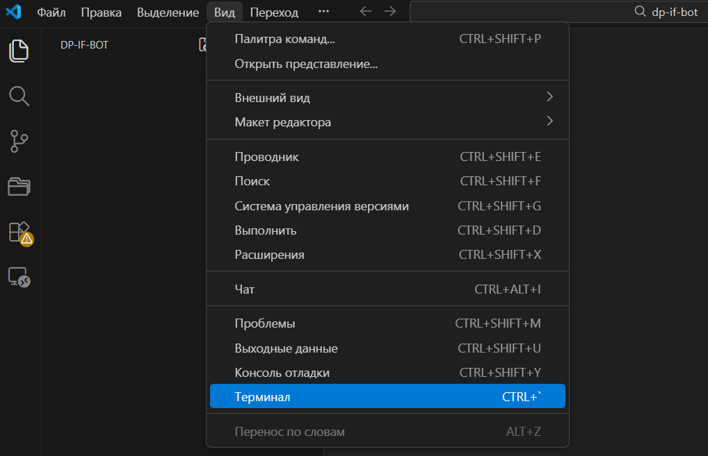
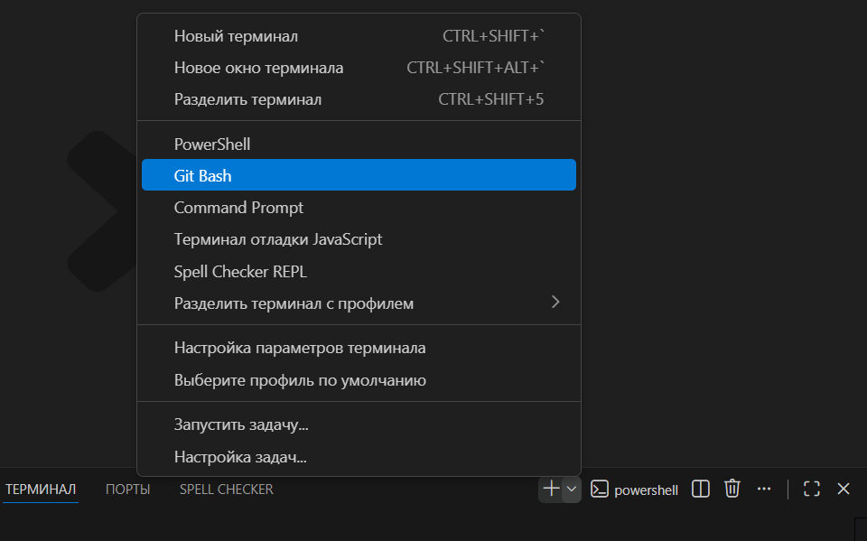
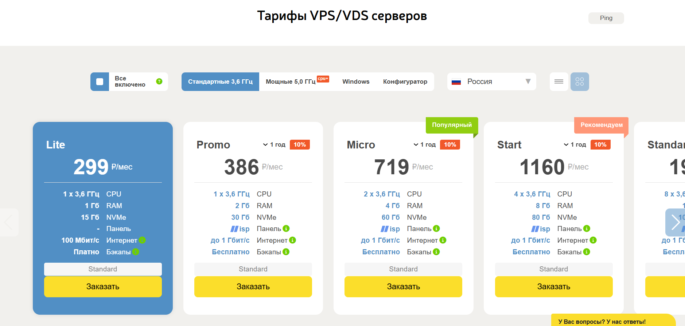
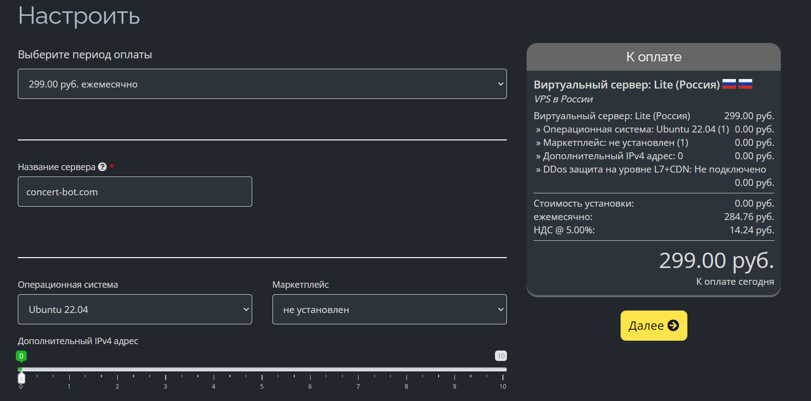

# 🎟 Telegram Bot для бронирования мест (https://t.me/DP_IF_bot)

Этот бот создан для бронирования мест в зале на концерт **«День Первокурсника»**.  
Он позволяет студентам выбирать места в зале, отменять бронь и получать билеты в удобное время.

---

## 📂 Структура проекта

```
project-root/
│── .env                  # переменные окружения (токен бота)
│── .gitignore
│── index.js              # точка входа
│
└── src/
    ├── bot.js            # инициализация Telegram Bot API
    ├── config.js         # конфигурация (токен и пр.)
    ├── users.js          # управление пользователями
    ├── hall.js           # описание зала и работы с местами
    ├── keyboards.js      # генерация inline-клавиатур
    ├── messages.js       # функции для отправки сообщений
    ├── zal_DP_IF.png     # схема зала
    └── handlers/
        ├── messageHandler.js   # обработка текстовых сообщений
        └── callbackHandler.js  # обработка нажатий кнопок
```

---

## ⚙️ Установка

1. В поиске Telegram найди бота @BotFather



2. Нажми кнопку "Старт" и выбери команду /newbot
   Введи имя бота, например: ДП 2026 ИФ КФУ
   Введи username бота, который будет ссылкой, например: Concert_IF_bot



3. BotFather пришлёт тебе сообщение, в котором будет выделен особым шрифтом
длинный токен. Скопируй его и никому не показывай!

4. Открой папку в которой будет лежать проект (в удобном для тебя месте)
   Открой её в VScode (скачать: https://code.visualstudio.com/)



5. Открой терминал Git Bash и склонируй репозиторий 

Cкачать git: https://git-scm.com/install/




```bash
git clone https://github.com/GoldExtremal/dp-if-bot.git
```

6. Перейди в эту папку с помощью команды:

```bash
cd dp-if-bot
```

7. Установи зависимости:

```bash
npm install
npm install node-telegram-bot-api
npm install dotenv
```

8. Создай файл `.env` в корне проекта и добавь в него токен бота (его тебе скинул BotFather):

```env
TELEGRAM_TOKEN=твой_токен_бота
```

9. Настройка бота

Изменить информацию о концерте:
    - файл messageHandler.js строка 25

Изменить информацию о месте/времени выдачи билетов:
    - файл hall.js строки 174-176

Изменить название бота, фото и описание можно в настройках чата в приложении телеграм (кнопка "управление" доступна владельцу бота)

---

## 🚀 Запуск (локально)

```bash
node index.js
```

Бот запущен. Проверь, что всё работает, настрой отображение бота и описание как тебе нужно.

---

## 💡 Основные команды бота

- **`/start`** — запуск бота, приветственное сообщение.  
- **`/getBookingList`** — список всех броней по группам получения.

Через меню доступны:
- 🎟 **Все мои билеты** — показать список забронированных мест.  
- ❌ **Отменить бронь** — отмена выбранных билетов.  
- ➕ **Забронировать ещё** — вернуться к выбору секции и мест.  

---

## 🪑 Логика работы

1. Пользователь вводит **Фамилию Имя**.  
2. Бот показывает схему зала с доступными секциями.  
3. Пользователь выбирает места → они становятся занятыми (❌).  
4. После выбора можно указать место получения билетов.  
5. Бот сохраняет бронь, позволяет просмотреть или отменить её.  

---

## 🖼 Пример вывода билетов

```
Все твои билеты:

Ряд 2, Место 3
Ряд 2, Место 4
Ряд 4, Место 24
Ряд 4, Место 25
Ряд 10, Место 5
Ряд 10, Место 6

Место получения:
🔥10.03 12:00-14:00 - ИФ, 1 этаж у буфета
```

---

## 🚀 Запуск (выгрузка на сервер и официальный запуск)

Для запуска бота нужно арендовать удалёный сервер и загрузить туда проект.
Для примера будем использовать AdminVPS.

1. Перейди на сайт и зарегистрируйся: https://adminvps.ru/

2. В разделе услуги выбери "серверы" и нажми кнопку "Заказать"

3. Выбери тариф Lite и нажми заказать



4. Придумай название для сервера и нажми далее



5. Оплати по СБП с любой российской карты и подожди 5-10 минут пока настроится сервер

6. В разделе мои серверы выбери свой и скопируй iP адрес

7. Подключись к серверу, обнови пакеты и установи Git, NodeJS, npm 

```bash
ssh root@твой.iP.адрес
sudo apt-get update
sudo apt install git
sudo apt install nodejs
sudo apt install npm
sudo apt-get upgrade
sudo apt remove libnode-dev
sudo dpkg --configure -a
sudo apt install -f
sudo apt install nodejs
```

На все вопросы в терминале жми Yes/Ok/Enter

8. Склонируй git репозиторий с гитхаба и перейди в папку проекта

Зарегистрируйся на GitHub и загрузи туда свою копию проекта командой 

```bash
git push
```

После склонируй репозиторий на сервер:

```bash
git clone https://github.com/GoldExtremal/dp-if-bot.git
cd dp-if-bot
```


9. Установи все зависимости и пакет pm2

```bash
npm install
cd
npm i pm2 -g
```

10. Добавь токен бота на сервер

```bash
cd dp-if-bot
nano .env
```

Cкопируй токен бота из файла Ctrl+A Ctrl+C и вставь в nano: 

```
Ctrl+Shift+V
Ctrl+O
Enter
Ctrl+X
```

10. Запусти бота на сервере в фоновом режиме

```bash
cd dp-if-bot
pm2 start index.js
```

---

## Если возникнут проблемы при установке на сервер

Гайд на деплой: https://youtu.be/slcqnHIFrj8?si=5p5hR6NI6f95Fls1 

Ошибки из консоли в ChatGPT, там ничего сложного, он поможет))


## 🛠 Используемые технологии

- [Node.js](https://nodejs.org/)  
- [node-telegram-bot-api](https://github.com/yagop/node-telegram-bot-api)  
- [dotenv](https://www.npmjs.com/package/dotenv)  

---

## 📌 Особенности

- Места в билете и списках сортируются по номеру ряда.  
- В списках билетов **не выводится секция**, только ряд и место.  
- Поддержка стикеров для визуальной обратной связи.  

---

## 👨‍💻 Автор
Бот написан специально для организации мероприятий в КФУ.  
